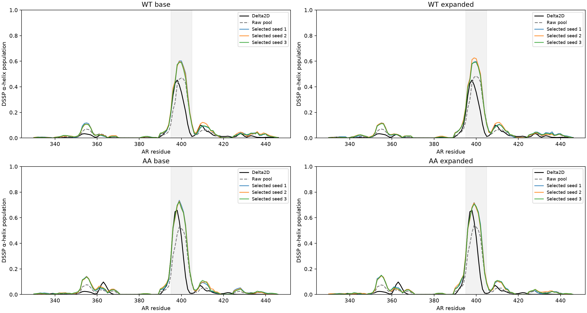
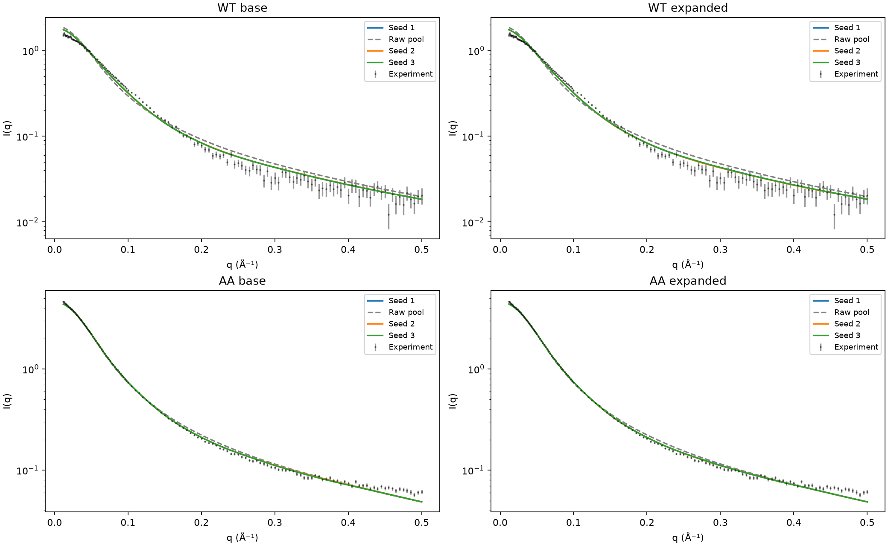
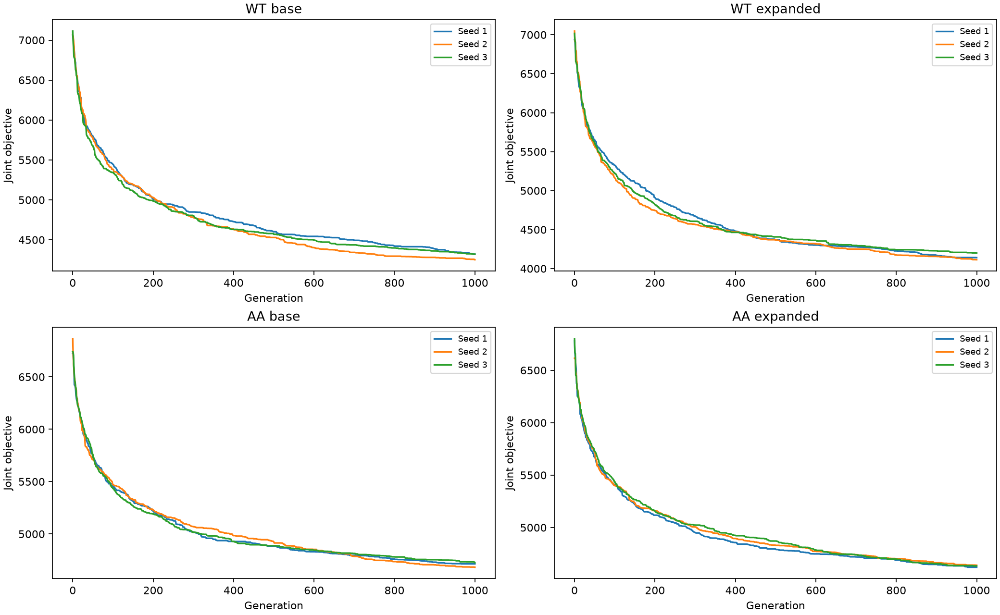
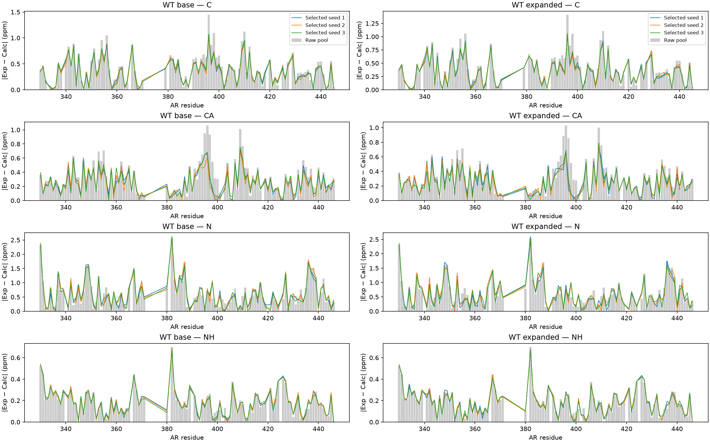
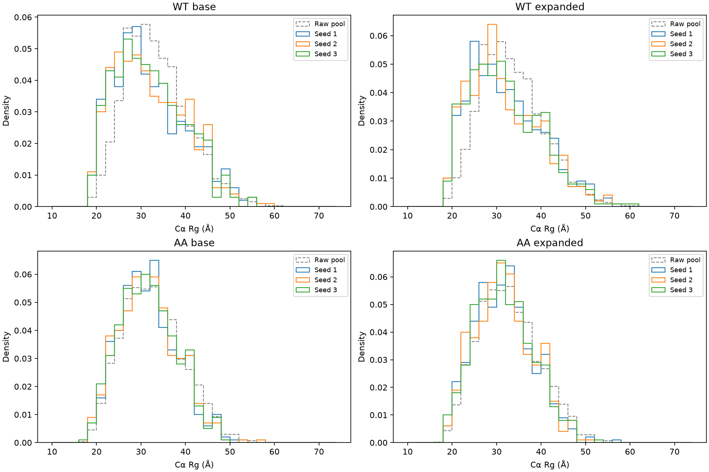

# Joint CS/SAXS selections: first candidate pools

Independent ASTEROIDS-style equal-weight genetic subset selection, not the original ASTEROIDS executable. Each result has 500 distinct conformers with weight 1/500. WT and AA base pools contain 2,000 conformers; expanded pools contain 2,110 and 2,090, respectively. Three optimization seeds per candidate pool; these are not independent generated pools.

Objective: sum over chemical shifts of ((ensemble mean − experiment)/scale)^2 plus sum over SAXS points of ((a Icalc − Iexp)/experimental error)^2. Nonnegative multiplicative SAXS scale a is optimized analytically. CS scales: Cα/C′/Cβ 0.10 ppm, N 0.50 ppm, HN/Hα 0.20 ppm. No fitted shift offsets or additive SAXS background. Available measured shifts are used; terminal model residues 1–2 and 120 are excluded. Secondary shifts use the sequence-specific SPARTA+ random-coil reference.

All runs completed 1,000 generations, population 100. Completion is not evidence of convergence. See convergence.json for seed spread and continuing objective improvement. Independent second candidate pools have not been assessed here. Delta2D and DSSP helicity are distinct observables.

fit_metrics.csv contains all raw and selected RMSDs and SAXS mean squared standardized residuals. Subdirectories contain selected member lists, per-residue shifts, helicity and SAXS curves for every seed. Source PDB paths refer to the local analysis workspace; structures are not embedded in these CSV files.

Within-pool selected DSSP helix seed ranges are at most 4.0 percentage points (WT base), 3.6 (WT expanded), 2.2 (AA base), and 2.6 (AA expanded). Objectives still improve by 0.34–1.56% over the final 100 generations; optimization has not demonstrated a plateau. Contact-map convergence is not yet assessed.

[Download all numerical results and selected membership lists](selection_results.zip).
