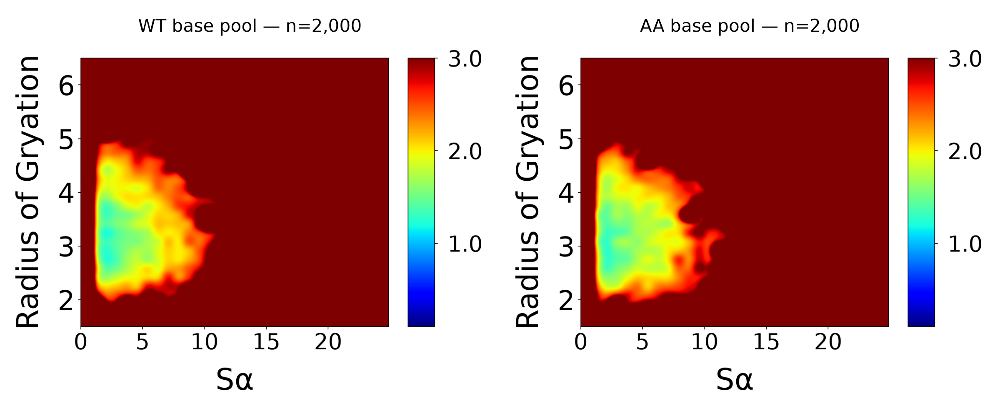
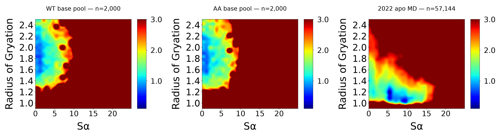
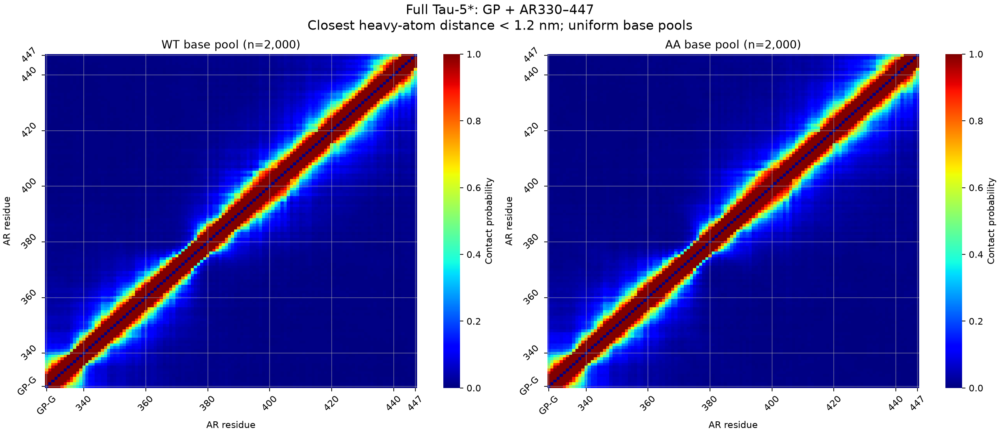
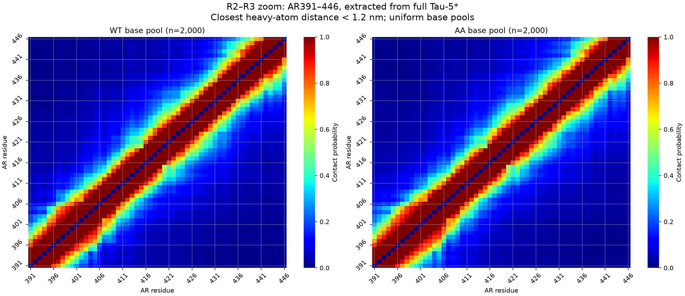

# Ensemble Comparisons

## Ensembles and residue mapping

WT Tau-5* and W397A/W433A (AA): the first **2,000-member IDPConfGen base pool** for each sequence, uniformly averaged, without the supplemental long-helix structures or fitted weights. These are the same frozen member lists used for the Sα–Rg comparison. This page does not show bAIes trajectories; those have not yet been generated.

Full chain: **GP + AR330–447**, 120 residues. R2–R3: **AR391–446**, 56 residues (model residues 64–119). Zoom-ins extract these residues from the full-chain conformers; they are not independently simulated short constructs. The Sα–Rg comparison also includes the original 2022 apo R2–R3 MD ensemble.

## Sα versus Rg

### Full Tau-5*: WT and AA

[PDF](Sa_Rg/full_side_by_side.pdf)

### Matched R2–R3 segment: WT, AA, and original apo MD

[PDF](Sa_Rg/R2R3_side_by_side.pdf) · [Definitions and provenance](Sa_Rg/README.md) · [Numerical summary](Sa_Rg/summary.json) · [Per-conformer observables](Sa_Rg/pool_observables.csv)

These use the original AR_ligand_binding notebook plotting cell: 30-bin density histogram, −RT ln(density + 10⁻⁶), Gaussian display interpolation, jet, and color limits 0.1–3.0. For generated conformer pools, this is a transformed sampling density, not a thermodynamic free energy. Rg is Cα geometric Rg in nm. Sα is the sum of seven-residue backbone RMSD switching functions; full-chain and cropped scores contain different numbers of windows.

## Contact maps

### Full Tau-5*: WT and AA

[PDF](Contact_Maps/full_WT_AA.pdf)

### R2–R3 zoom: AR391–446

[PDF](Contact_Maps/R2R3_WT_AA.pdf)

### Contact definition and implementation

From cells 26–27 of [Zhu_AR_Ligands_Apo.9.27.22.ipynb](https://github.com/paulrobustelli/AR_ligand_binding): a residue pair is in contact when its **closest heavy-atom distance is <1.2 nm (12 Å)**. The map is the fraction of conformers in contact. Diagonal entries are zero; adjacent residues are included, matching the original code. This is the notebook's general contact-map definition, not its separate aromatic-contact switching function.

The calculation batches unique pairs and mirrors the matrix, equivalent to the original pair-by-pair loop. Plots retain seaborn heatmap, jet, grid, and inverted y axis. Changes for comparison: shared probability scale 0–1, side-by-side panels, full-chain extent, and residue labels at cell centers. GP is retained but has no native AR numbering; the first tick labels its added glycine.

[Original calculation/plot cells](Contact_Maps/original_contact_cells.py) · [Calculation script](scripts/plot_contact_comparisons.py) · [Membership and sequence manifest](Contact_Maps/manifest.json)

Matrices: [WT full](Contact_Maps/WT_full.csv), [AA full](Contact_Maps/AA_full.csv), [WT R2–R3](Contact_Maps/WT_R2R3.csv), [AA R2–R3](Contact_Maps/AA_R2R3.csv). Full matrices follow GP, AR330–447; zoom matrices follow AR391–446. Entries are probabilities, not distances.

## Other analyses

[Chemical shifts and existing fitted-weight comparisons](../Chemical_shift_SAXS/) remain separate from these base-pool averages. Scripts here retain the original workspace-relative data paths; the numerical outputs and membership manifests are provided for traceability.
